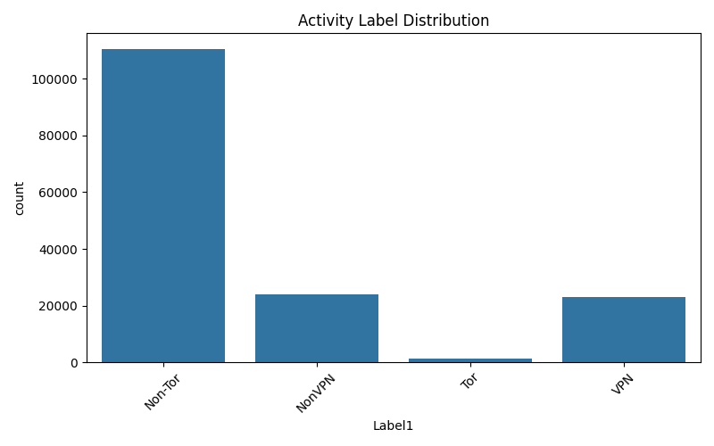

# Assignment-3

Darknet Traffic Analysis and Activity Prediction

This project focuses on analyzing darknet network traffic and applying machine learning techniques to predict the type of activity occurring in the network. Darknet traffic classification is important in cybersecurity because it helps distinguish between normal traffic and anonymized traffic such as Tor or VPN usage. A supervised learning approach using a Random Forest classifier was implemented to perform this task.

**Dataset Loading**

The dataset was loaded using the Pandas library. Initial inspection was performed to verify the structure and contents of the dataset.

```
df = pd.read_csv("Darknet.csv")

print("First 5 rows of dataset:")
print(df.head())
print("\nDataset Info:")
print(df.info())
```

This ensures that the dataset is correctly loaded and helps identify the number of features, data types, and overall size.

**Exploratory Data Analysis (EDA)**

Exploratory Data Analysis was conducted to check for missing values and to understand the distribution of traffic classes.

```
print("\nMissing values per column:")
print(df.isnull().sum())

print("\nClass distribution:")
print(df['Label1'].value_counts())
```

The results show that the dataset contains no missing values. However, the class distribution reveals a strong imbalance, with Non-Tor traffic being the most frequent class.

**Visualization of Activity Labels**

To better understand class imbalance, a bar chart was used to visualize the distribution of traffic types.

```
plt.figure(figsize=(8,5))
sns.countplot(x='Label1', data=df)
plt.title("Activity Label Distribution")
plt.xticks(rotation=45)
plt.tight_layout()
plt.show()
```

This visualization clearly shows that Tor traffic is significantly underrepresented compared to other classes, which may affect model performance.

**Data Preprocessing**

Since machine learning models require numerical input, the categorical traffic labels were encoded using label encoding.

```
le = LabelEncoder()
df['Label1'] = le.fit_transform(df['Label1'])

X = df.drop('Label1', axis=1)
y = df['Label1']
```

This method converts text labels into numerical values and separates features from the target variable.

**Train–Test Split**

The dataset was split into training and testing sets to evaluate the model on unseen data.

```
X_train, X_test, y_train, y_test = train_test_split(
    X, y,
    test_size=0.2,
    random_state=42,
    stratify=y
)
```

An 80/20 split was used, and stratification ensured that class proportions were preserved.

**Model Training**

A Random Forest classifier was chosen due to its robustness and suitability for high-dimensional network traffic data.

```
model = RandomForestClassifier(
    n_estimators=100,
    random_state=42,
    n_jobs=-1
)

model.fit(X_train, y_train)

```
The model learns patterns between network traffic features and traffic types during this phase.

**Model Evaluation**

After training, the model’s performance was evaluated using accuracy and classification metrics.

```
y_pred = model.predict(X_test)

print("\nModel Accuracy:", accuracy_score(y_test, y_pred))
print("\nClassification Report:")
print(classification_report(y_test, y_pred))
```

A confusion matrix was also generated to visualize prediction errors across classes.

```
cm = confusion_matrix(y_test, y_pred)

plt.figure(figsize=(8,6))
sns.heatmap(cm, annot=True, fmt='d', cmap='Blues')
plt.title("Confusion Matrix")
plt.xlabel("Predicted Label")
plt.ylabel("True Label")
plt.tight_layout()
plt.show()
```

**Feature Importance Analysis**

Feature importance analysis was performed to identify which traffic features most influenced model predictions.

```
importances = model.feature_importances_
features = X.columns

importance_df = pd.DataFrame({
    'Feature': features,
    'Importance': importances
}).sort_values(by='Importance', ascending=False)

print("\nTop 10 Important Features:")
print(importance_df.head(10))
```

This improves model interpretability and helps understand key indicators of different traffic types.

**Sample Prediction**

Finally, the model was tested on a sample network flow to demonstrate real-world usage.
```
Code Snippet:
sample = X_test.iloc[0:1]
prediction = model.predict(sample)

print("\nPredicted Activity:", le.inverse_transform(prediction))

```


**Visualization**


