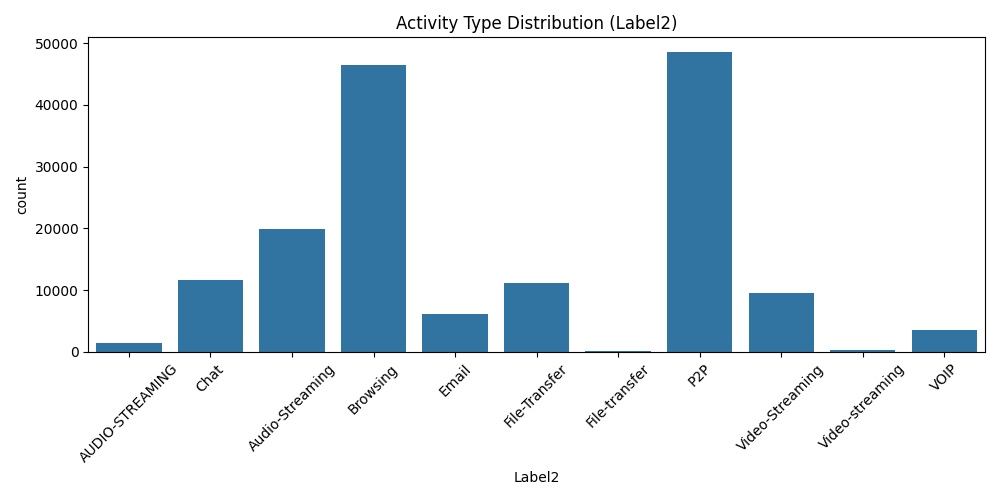

# Assignment-3


This project focuses on analyzing darknet network traffic and applying machine learning techniques to predict both the type of traffic transmission and the type of user activity occurring within the network. Darknet traffic classification is an important area in cybersecurity, as it helps distinguish between normal network communication and anonymized traffic such as Tor or VPN usage, as well as identify the underlying application behavior.

To achieve this, a supervised machine learning approach was implemented using Random Forest classifiers. Two classification tasks were performed:

predicting the traffic anonymity type (Label1), and predicting the application-level activity (Label2).

This dual-level classification provides a more comprehensive understanding of network behavior.

**Dataset Loading and Inspection**

The dataset used in this project is Darknet.csv, which contains over 158,000 network flow records and 85 features. Each record represents a network flow and includes statistical information such as packet counts, flow duration, inter-arrival times, and TCP flag statistics.

```
df = pd.read_csv("Darknet.csv")

print("First 5 rows of dataset:")
print(df.head())
print("\nDataset Info:")
print(df.info())
```

Initial inspection confirmed that the dataset was successfully loaded and that it contains both numerical traffic features and categorical label columns.


**Exploratory Data Analysis (EDA)**

Exploratory Data Analysis was performed to assess data quality and understand class distributions.

```
print("\nMissing values per column:")
print(df.isnull().sum())

print("\nLabel1 distribution:")
print(df['Label1'].value_counts())

print("\nLabel2 distribution:")
print(df['Label2'].value_counts())
```

The analysis showed that the dataset contains no missing values, indicating good data quality. However, the distribution of Label1 revealed a significant class imbalance, with Non-Tor traffic dominating the dataset and Tor traffic appearing far less frequently. Label2 also showed an uneven distribution across different application categories.

**Visualization of Traffic and Activity Distributions**

To better understand class imbalance, bar charts were used to visualize both traffic types (Label1) and activity types (Label2).

```
plt.figure(figsize=(8,5))
sns.countplot(x='Label1', data=df)
plt.title("Traffic Type Distribution (Label1)")
plt.xticks(rotation=45)
plt.tight_layout()
plt.show()

plt.figure(figsize=(10,5))
sns.countplot(x='Label2', data=df)
plt.title("Activity Type Distribution (Label2)")
plt.xticks(rotation=45)
plt.tight_layout()
plt.show()
```

These visualizations clearly show that some classes, particularly Tor traffic and certain activity types, are underrepresented. This imbalance can influence model performance and must be considered during evaluation.

 **Data Preprocessing**

Since machine learning algorithms require numerical input, categorical labels were converted into numerical values using label encoding. Two separate target variables were defined:

Label1: traffic anonymity type (Non-Tor, Tor, VPN, NonVPN)

Label2: application-level activity

The same numerical feature set was used for both classification tasks.

```
le1 = LabelEncoder()
y1 = le1.fit_transform(df['Label1'])

le2 = LabelEncoder()
y2 = le2.fit_transform(df['Label2'])

X = df.drop(columns=df.select_dtypes(include=['object']).columns)
```


**Train–Test Split**

The dataset was split into training and testing sets using an 80/20 ratio. Stratified sampling was applied to preserve class distributions for both Label1 and Label2.

```
X_train, X_test, y1_train, y1_test = train_test_split(
    X, y1, test_size=0.2, random_state=42, stratify=y1
)

X2_train, X2_test, y2_train, y2_test = train_test_split(
    X, y2, test_size=0.2, random_state=42, stratify=y2
)
```

**Model Training**

Two separate Random Forest classifiers were trained using the same feature set:

Model 1: predicts traffic anonymity type (Label1)

Model 2: predicts application-level activity (Label2)

Random Forest was chosen due to its robustness, ability to handle high-dimensional data, and resistance to overfitting.

```
model_label1 = RandomForestClassifier(n_estimators=100, random_state=42, n_jobs=-1)
model_label2 = RandomForestClassifier(n_estimators=100, random_state=42, n_jobs=-1)

model_label1.fit(X_train, y1_train)
model_label2.fit(X2_train, y2_train)
```


**Model Evaluation**

Both models were evaluated using accuracy and detailed classification metrics such as precision, recall, and F1-score. Confusion matrices were also used to visualize prediction performance.

```
y1_pred = model_label1.predict(X_test)
y2_pred = model_label2.predict(X2_test)

print("Label1 Accuracy:", accuracy_score(y1_test, y1_pred))
print(classification_report(y1_test, y1_pred, target_names=le1.classes_))

print("Label2 Accuracy:", accuracy_score(y2_test, y2_pred))
print(classification_report(y2_test, y2_pred, target_names=le2.classes_))
```

The results demonstrate that the model performs well on majority classes, while minority classes such as Tor traffic remain more challenging to classify.

**Feature Importance Analysis**

Feature importance analysis was conducted using the Label1 model to identify which traffic features most influenced classification decisions.

```
importances = model_label1.feature_importances_
importance_df = pd.DataFrame({
    'Feature': X.columns,
    'Importance': importances
}).sort_values(by='Importance', ascending=False)

print(importance_df.head(10))
```

This analysis improves model interpretability and highlights key network characteristics used for traffic classification.


**Sample Prediction**

To demonstrate real-world applicability, both models were used to predict the traffic type and activity type of a sample network flow.

```
sample = X_test.iloc[0:1]

print("Predicted Traffic Type:", le1.inverse_transform(model_label1.predict(sample)))
print("Predicted Activity Type:", le2.inverse_transform(model_label2.predict(sample)))
```


**Visualization**



